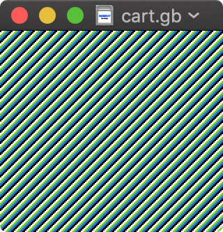

Display a simple background & scroll with the joypad.

## Prerequisites

- [RGBDS][rgbds] to build the code
- [ImageMagick][magick] and [GNU Awk][gawk] to build the graphics

[rgbds]: https://github.com/rednex/rgbds
[magick]: https://imagemagick.org/index.php
[gawk]: https://www.gnu.org/software/gawk/

## Build the cartridge

To build the `cart.gb` file:

    $ make cart.gb

## Run the cartridge

Open the `cart.gb` file in your favorite Game Boy emulator or load it in your linker.

Note: tested on Game Boy Color.

## References

### Manuals

- <https://archive.org/details/GameBoyProgManVer1.1/mode/2up>
- <http://marc.rawer.de/Gameboy/Docs/GBCPUman.pdf>
- <https://rednex.github.io/rgbds/gbz80.7.html>

### Tools

Assemblers:

- <https://rednex.github.io/rgbds/>
- <https://github.com/vhelin/wla-dx>
- <https://wla-dx.readthedocs.io/en/latest/>

Emulators with debugger:

- <https://sameboy.github.io/debugger/>
- <https://emulicious.net/>

### Examples

Community:

- <http://bgb.bircd.org/pandocs.htm>
- <https://gbdev.github.io/>
- <https://fms.komkon.org/GameBoy/>
- <https://fms.komkon.org/GameBoy/Tech/Software.html>
- <https://github.com/gbdev/awesome-gbdev>
- <https://github.com/gbdev/hardware.inc>
- <http://devrs.com/gb/index.php>
- <https://www.pastraiser.com/cpu/gameboy/gameboy_opcodes.html>

Tutorials:

- <https://eev.ee/blog/2018/07/05/cheezball-rising-main-loop-input-and-a-game/>
- <https://eldred.fr/gb-asm-tutorial/>
- <https://www.chibiakumas.com/z80/Gameboy.php>
- <https://gist.github.com/iamgreaser/9cccd24dd4519a0ae95240d8b8eeb252>
- <https://exez.in/gameboy-dma>
